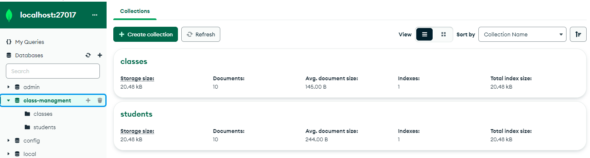
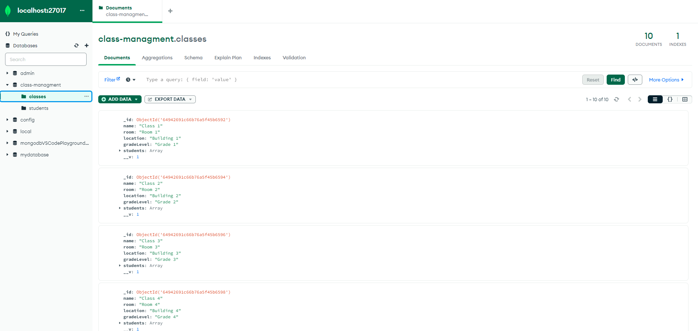
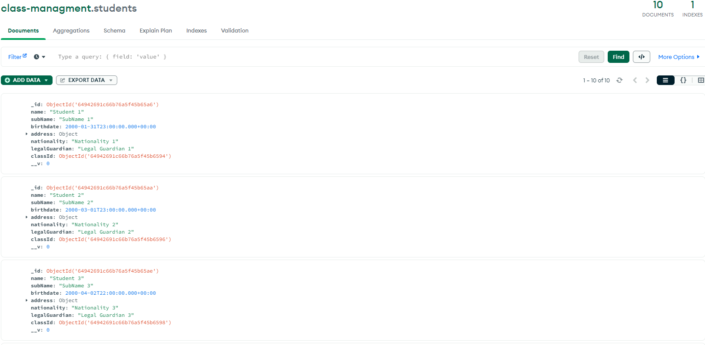
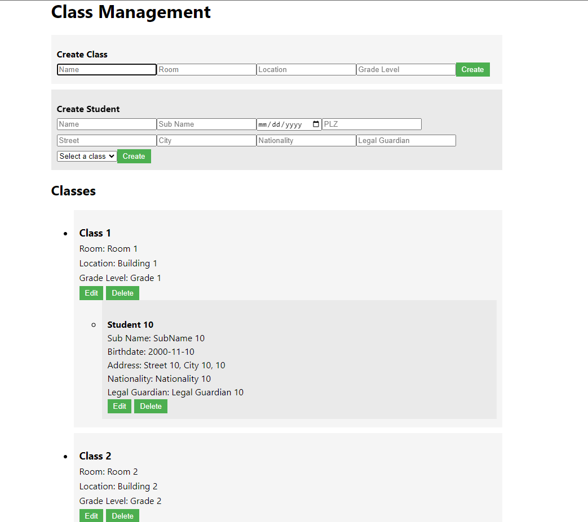

# Documentation

# Einleitung M165
Im Rahmen dieses Projektauftrags werden wir eine Applikation entwickeln, die auf eine MongoDB-Datenbank zugreift und sowohl Lese- als auch Schreibzugriffe ermöglicht. Wir haben die Möglichkeit, das Projekt entweder alleine oder in Partnerschaft mit einer anderen Person umzusetzen, dabei haben wir uns für eine Partnerarbeit entschieden 

Ein wichtiger Bestandteil der Dokumentation ist das Arbeitsjournal, in dem wir ausführlich zu jedem Unterrichtsabschnitt reflektieren. Dabei beantworten wir Fragen wie: Was haben wir erledigt? Wie sind wir vorgegangen? Welche Schwierigkeiten sind uns begegnet und wie konnten wir sie lösen? Welche Aufgaben stehen als nächstes an? Was haben wir aus dem Unterricht gelernt? In unserem Falle haben wir uns für ein Einfaches „Ziel - Lösungsweg – Reflexion“ Schema entschieden. 

Die Applikation, die im Projekt entwickelt wird, greift auf eine MongoDB-Datenbank zu und ermöglicht das Anzeigen, Erstellen, Bearbeiten und Löschen von Dokumenten in der MongoDB-Datenbank Dabei werden zwei Collections mit einer 1:m-Beziehung oder Sub-Dokumente verwendet. Die Applikation soll benutzerfreundlich sein, Fehlererkennung bieten und Testdaten enthalten. 

# Arbeitsjournal

[weiteres-dokument.md](weiteres-dokument.md) 

# Zusammenfassung der Datenbankstruktur

Die Datenbank des Klassenmanagementsystems besteht aus zwei Sammlungen: "Class" und "Student". Hier ist eine Zusammenfassung der Felder in beiden Sammlungen:

## Class-Sammlung

- `_id`: Eindeutiger Identifikator des Dokuments.
- `name`: Name der Klasse.
- `room`: Raum, in dem die Klasse stattfindet.
- `location`: Standort des Klassenraums.
- `gradeLevel`: Klassenstufeniveau.
- `students`: Array von Referenzen auf Schüler-Dokumente, die zur Klasse gehören.

## Student-Sammlung

- `_id`: Eindeutiger Identifikator des Dokuments.
- `name`: Vorname des Schülers.
- `subName`: Nachname des Schülers.
- `birthdate`: Geburtsdatum des Schülers.
- `address`: Objekt mit den Adressdetails des Schülers (PLZ, Straße, Stadt).
- `nationality`: Nationalität des Schülers.
- `legalGuardian`: Name des rechtlichen Vormunds des Schülers.
- `classId`: Referenz auf das "Class" Dokument, zu dem der Schüler gehört.

Die "Class"-Sammlung enthält Informationen über die Klassen, einschließlich ihrer Namen, Raumdetails, Standort und Klassenstufen. Die "Student"-Sammlung enthält Informationen über die Schüler, einschließlich ihrer Namen, Geburtsdaten, Adressen, Nationalität und rechtlichen Vormunde. Die "students" Feld in der "Class"-Sammlung enthält Referenzen auf die Schüler, die zur entsprechenden Klasse gehören.

Diese Datenbankstruktur ermöglicht es, die Beziehungen zwischen Klassen und Schülern effizient zu verwalten und abzufragen, indem Referenzen verwendet werden, um auf die relevanten Dokumente in den jeweiligen Sammlungen zu verweisen.

## DB bearbeiten

# Zusammenfassung des Backends

Das Backend des Klassenmanagementsystems besteht aus Node.js-Dateien, die Express verwenden und mit einer MongoDB-Datenbank interagieren. Die wichtigsten Dateien und Funktionen sind:

- `server.js`: Erstellt den Express-Server, verbindet sich mit der MongoDB und definiert Routing-Endpunkte.
- `db.js`: Stellt die Verbindung zur MongoDB-Datenbank her.
- `models/class.js`: Definiert das Mongoose-Modell für Klassen.
- `models/student.js`: Definiert das Mongoose-Modell für Schüler.
- `controllers/classController.js`: Enthält Funktionen zur Verwaltung von Klassen.
- `controllers/studentController.js`: Enthält Funktionen zur Verwaltung von Schülern.
- `routes.js`: Definiert die Routing-Endpunkte für die API.

Das Backend ermöglicht das Erstellen, Aktualisieren, Löschen und Abrufen von Klassen und Schülern über die bereitgestellten API-Endpunkte. Die Datenbankinteraktion erfolgt über die Mongoose-Modelle, die eine Abstraktionsschicht über der MongoDB-Datenbank bieten.

# Zusammenfassung des GUI-Codes

Der gegebene Code implementiert ein GUI für das Klassenmanagement-System. Es basiert auf React und verwendet verschiedene Komponenten und API-Aufrufe, um mit dem Backend zu interagieren.

## App-Komponente

Die `App`-Komponente ist die Hauptkomponente, die den gesamten Inhalt der Anwendung enthält. Sie verwaltet den Zustand der Klassen, Schüler und der bearbeiteten Klasse/Schüler mithilfe des `useState`-Hooks. Die Komponente implementiert folgende Funktionen:

- `fetchClasses`: Ruft Klassen vom Server ab und ruft `fetchStudentsByClassId` für jede Klasse auf, um die zugehörigen Schüler abzurufen.
- `useEffect`: Ruft `fetchClasses` einmalig auf, wenn die Komponente geladen wird.
- `fetchStudentsByClassId`: Ruft Schüler anhand der Klassen-ID vom Server ab und aktualisiert den entsprechenden Zustand.
- `handleEditClass` und `handleEditStudent`: Aktualisieren den Zustand der bearbeiteten Klasse bzw. des bearbeiteten Schülers.
- `handleUpdateClass`, `handleUpdateStudent`, `handleDeleteClass` und `handleDeleteStudent`: Aktualisieren bzw. löschen eine Klasse oder einen Schüler über die entsprechenden API-Aufrufe.
- `handleCreateClass` und `handleCreateStudent`: Erstellen eine neue Klasse bzw. einen neuen Schüler über die entsprechenden API-Aufrufe.
- `formatedBirthday`: Formatieren des Geburtsdatums eines Schülers in das richtige Format.

## API-Funktionen

Es gibt zwei Dateien, die API-Funktionen enthalten: `classApi.js` und `studentApi.js`. Diese Funktionen ermöglichen die Kommunikation mit dem Backend und enthalten Methoden zum Erstellen, Aktualisieren, Löschen und Abrufen von Klassen und Schülern über HTTP-Anfragen an die entsprechenden Endpunkte.

## CreateClass- und CreateStudent-Komponenten

Diese Komponenten implementieren jeweils ein Formular zum Erstellen einer neuen Klasse bzw. eines neuen Schülers. Sie verwenden die entsprechenden API-Funktionen, um die Daten an das Backend zu senden.

Der Rest des Codes besteht aus JSX-Markup und ermöglicht die Darstellung und Interaktion mit den Daten im GUI.

